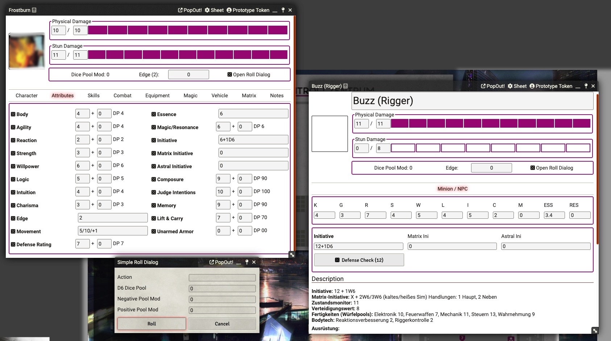

# Shadowrun6 Leightweight System for FoundryVTT

This system is a Shadowrun 6 lightweight implementation. It's easy to use and almost no auto calculations are done. Everything can be entered manually assited with some help.
There's a simple roll dialog and you can do manual dice pool rolls with the chat command **/srr X**.
The system doesn't include any book materials and you will have to enter it for yourself.
This system is completely Unofficial.

## Features:

* character sheet
* minion / npc sheet
* vehicle sheet
* basic matrix actor sheet
* simple roll dialog and dice pool roll command to handle each possible situation in your game

## Translations:

* english
* german

## Minion / NPC sheet markdown

    [[/srr 4 # Some Minion Skillcheck]]

Enter the above code in a npc sheet to add some easier way to access different skill checks. You can simply click on the generated text
to open the roll dialog with the provided data.

### Chat commands

    /srr Number

Simply enter **/srr Number** in the chat to make a manual dice pool roll with *Number* of D6 dices.

### Discord

You can reach me on Discord via MrTheBino#7878

## Changelog:

### v0.4

* added attribute modifiers for easier tracking of the base attributes
* roll dialog for ranged & melee weapons
### v0.3

* added UI improvements
* added translations
* added vehicle actor
* added basic matrix actor
* dice pool modificator gets calculated referencing the condition monitor

### v0.2

* first public release

